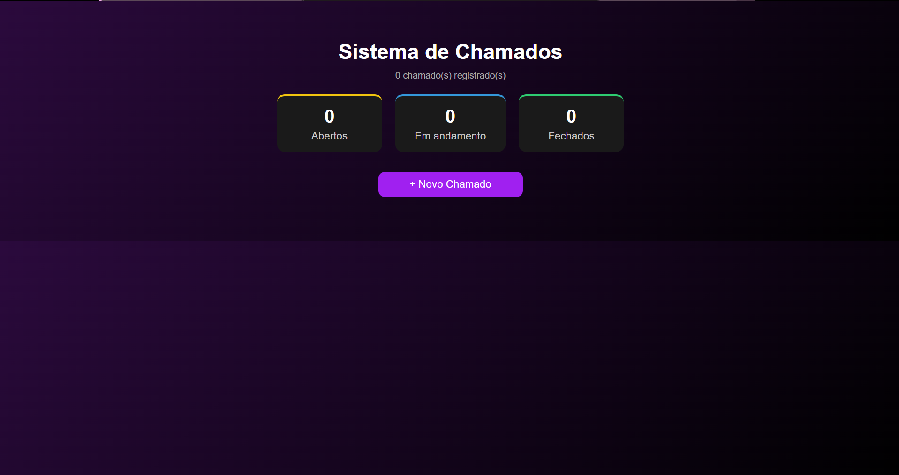
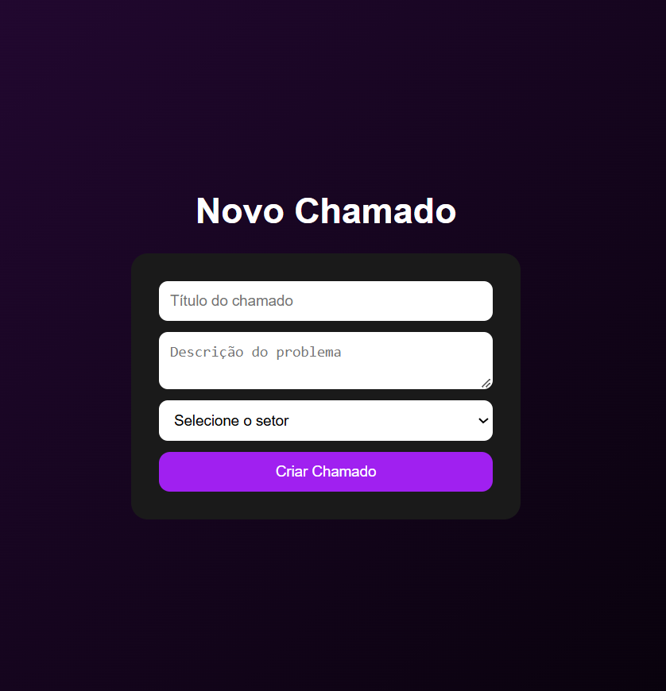
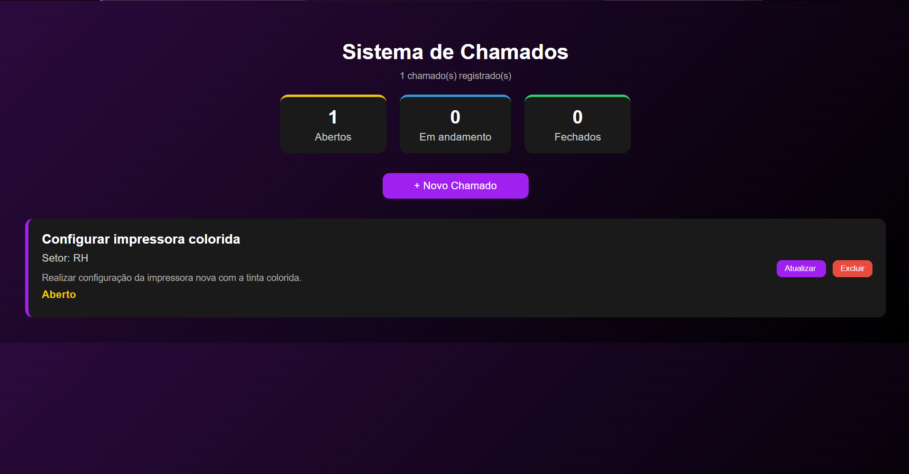
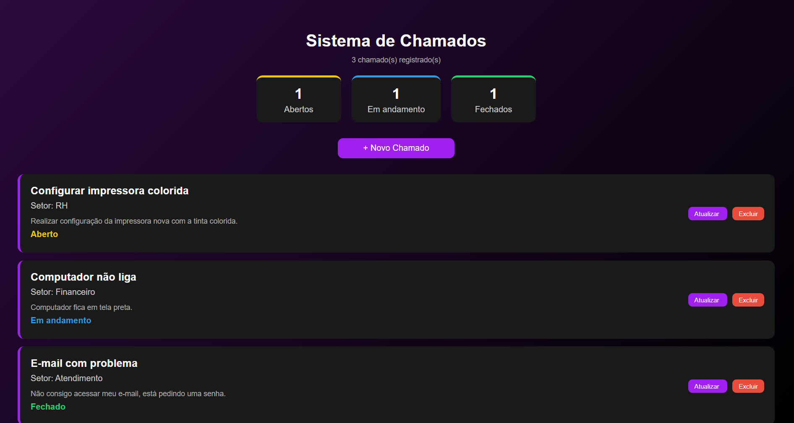

# 🎫 Sistema de Chamados

Sistema web para gerenciamento de chamados internos, desenvolvido com **Python e Flask**.

O projeto permite cadastrar chamados, visualizar as solicitações, acompanhar o status e excluir chamados. Os dados são armazenados em um arquivo JSON.

---

## 📌 Sobre o projeto

O **Sistema de Chamados** foi desenvolvido como um projeto prático para aplicar conhecimentos de desenvolvimento web com Python e Flask.

A aplicação simula um sistema utilizado por uma empresa para registrar e acompanhar solicitações de diferentes setores.

O projeto também foi desenvolvido com foco em praticar:

- Desenvolvimento de aplicações web
- Rotas com Flask
- Templates HTML
- Manipulação de formulários
- Persistência de dados
- Organização de projetos
- Integração entre Front-end e Back-end

---

## ⚙️ Funcionalidades

- ✅ Criar novos chamados
- ✅ Informar título e descrição do chamado
- ✅ Selecionar o setor responsável
- ✅ Visualizar chamados cadastrados
- ✅ Exibir a descrição de cada chamado
- ✅ Alterar o status do chamado
- ✅ Excluir chamados
- ✅ Contador de chamados registrados
- ✅ Resumo dos chamados por status
- ✅ Armazenamento dos dados em arquivo JSON

### 🔄 Status dos chamados

Os chamados seguem o seguinte fluxo:

**🟡 Aberto → 🔵 Em andamento → 🟢 Fechado → 🟡 Aberto**

---

## 📸 Demonstração

### 🏠 Tela inicial



### ➕ Criação de chamado



### 📋 Chamado cadastrado



### 🔄 Status dos chamados



---

## 🛠️ Tecnologias utilizadas

### Back-end

- Python
- Flask

### Front-end

- HTML5
- CSS3

### Armazenamento

- JSON

### Ferramentas

- Visual Studio Code
- Git
- GitHub

---

## 📂 Estrutura do projeto

```text
sistema-chamados-web/
│
├── static/
│   ├── imagens/
│   │   ├── tela-inicial.png
│   │   ├── novo-chamado.png
│   │   ├── chamado.png
│   │   └── status.png
│   │
│   └── style.css
│
├── templates/
│   ├── criar.html
│   └── index.html
│
├── app.py
├── chamados.json
├── requirements.txt
└── README.md
